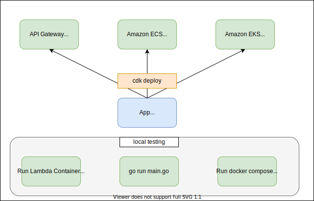

# serverless-mux-go

Local build, test and deploy your [gorilla/mux](https://github.com/gorilla/mux) application for **both** `AWS Lambda` and `AWS Fargate` with AWS CDK.



# Why

As Lambda has [container image support](https://aws.amazon.com/tw/blogs/aws/new-for-aws-lambda-container-image-support/) since AWS re:Invent 2020, one of the great advantages is that we can build our applications locally, bundling as container image, testing locally and eventually deploy it to `AWS Lambda`, `AWS Fargate`, `Amazon ECS` and even `Amazon EKS` with very little or even zero code change.

This sample demonstrates how to write a Golang web service with [gorilla/mux](https://github.com/gorilla/mux) with exactly the same code for all different AWS environments while you can build and test locally and eventually deploy `AWS Lambda` and `AWS Fargate` **at the same time** with `AWS CDK`.

# Deploy

```sh
# login and get the ecr public auth token for docker
$ aws ecr-public get-login-password --region us-east-1 | docker login --username AWS --password-stdin public.ecr.aws
$ cdk diff
$ cdk deploy
```

And you will get `Amazon API Gateway` endpoint URL as well as another one for `Amazon ECS` and `AWS Fargate` like:

```
Outputs:
ServerlessMuxOnAwsStack.APIEndpoint1793E782 = https://fkx4fvcbpj.execute-api.ap-northeast-1.amazonaws.com/prod/
ServerlessMuxOnAwsStack.FargateServiceExternalEndpoint5AA7423A = http://Serve-Farga-1BVTPNQ3S37Q8-991884679.ap-northeast-1.elb.amazonaws.com
```


# Local testing

To test the `main.go` natively:

```sh
go run main.go
```

To test as the Lambda container locally:

```sh
cd go
docker build -t lambda .
docker run -p 9000:8080 lambda
# open another terminal
curl -s -XPOST "http://localhost:9000/2015-03-31/functions/function/invocations" -d '{}'
```

To test with `docker compose` locally:

```sh
docker compose up
# open another terminal
curl 0:8080
```

